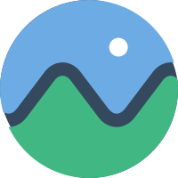

<p align="center">

</p>

<h1 align="center">Cesium VueUse</h1>

<p align="center">Cesium hooks like VueUse api.</p>

<p align="center">
<a href="https://www.npmjs.com/package/@cesium-vueuse/core" target="__blank"></a>
<a href="https://www.npmjs.com/package/@cesium-vueuse/core" target="__blank"></a>
<a href="https://github.com/GeoVueJS/cesium-vueuse" target="__blank"></a>
</p>

> 🚧 This project is under development, and the API may change frequently.

## Features

- 🎯 **Intuitive** - VueUse-style API design, familiar to Vue developers
- 💪 **Type Strong** - Written in TypeScript, with full TS support
- 🏪 **Modular** - Tree-shakeable ESM modules
- 🌐 **Full Featured** - Comprehensive Cesium functionality support
- 🎮 **Interactive** - Rich interactive capabilities with map elements
- ⚡️ **Lightweight** - No bloated dependencies

## Packages

| Package                                           | Version                                                                                                                     | Description                 |
| ------------------------------------------------- | --------------------------------------------------------------------------------------------------------------------------- | --------------------------- |
| [@cesium-vueuse/core](./packages/core/)           | [](https://www.npmjs.com/package/@cesium-vueuse/core)           | Core functionalities        |
| [@cesium-vueuse/plot](./packages/plot/)           | [](https://www.npmjs.com/package/@cesium-vueuse/plot)           | Drawing & plotting tools    |
| [@cesium-vueuse/serialize](./packages/serialize/) | [](https://www.npmjs.com/package/@cesium-vueuse/serialize) | State serialization         |
| [@cesium-vueuse/special](./packages/special/)     | [](https://www.npmjs.com/package/@cesium-vueuse/special)     | Special effects & materials |

## Install

```bash
# npm
npm i cesium @vueuse/core @cesium-vueuse/core

# yarn
yarn add cesium @vueuse/core @cesium-vueuse/core

# pnpm
pnpm add cesium @vueuse/core @cesium-vueuse/core
```

## Quick Start

```vue
<script setup>
import { createViewer, useCameraState } from '@cesium-vueuse/core';
import { ref } from 'vue';

// Create container ref
const cesiumContainer = ref(null);

// Create Cesium viewer instance
const viewer = createViewer(cesiumContainer);

// Use camera control hook
const { position, heading, pitch, roll } = useCameraState(viewer);

// Watch camera position changes
watch(position, (newPosition) => {
  console.log('Camera position updated:', newPosition);
});
</script>

<template>
  <div ref="cesiumContainer" style="width: 100%; height: 100%" />
</template>
```

## 🌸 Credits

- [VueUse](https://github.com/vueuse/vueuse) - Collection of Vue Composition Utilities
- [Cesium](https://github.com/CesiumGS/cesium) - An open-source JavaScript library for world-class 3D globes and maps

## 📄 License

[MIT](./LICENSE) License © 2024 [GeoVueJS](https://github.com/GeoVueJS)
